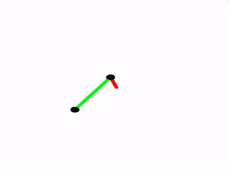

# Double Pendulum

Simulating a double pendelum by solving the Euler-Lagrange equation.

## Screencapture

## Getting Started

Run dobbelPendel2.m
### Prerequisites

MATLAB 2016a

## Authors

* **Håkon Gimse** - *Initial work* - [gimse](https://github.com/gimse)

